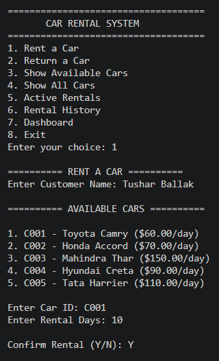
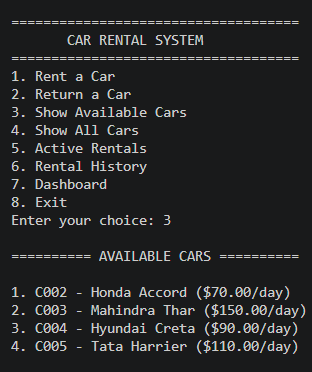
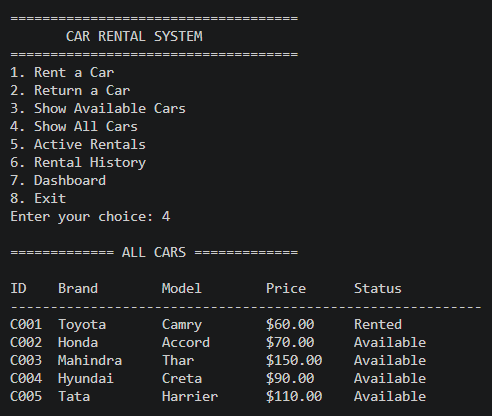
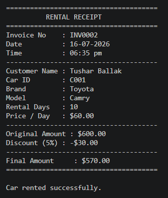
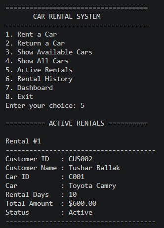
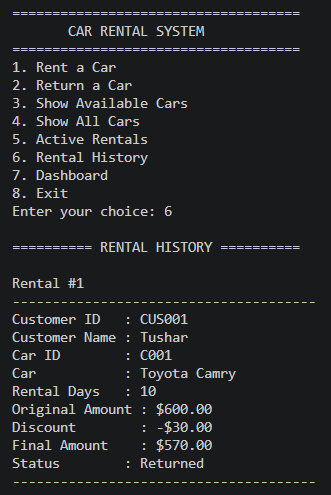
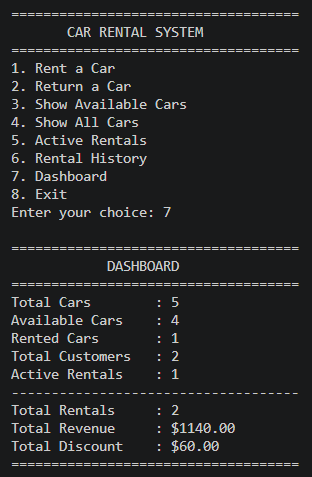
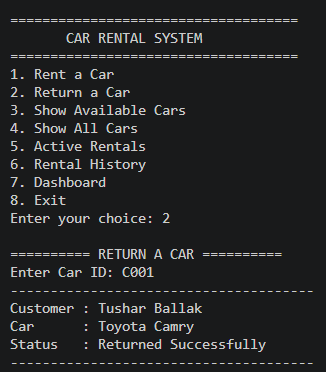

# Smart Car Rental System


---


## Table of Contents

- [Project Overview](#project-overview)
- [Features](#features)
- [Technologies Used](#technologies-used)
- [Project Structure](#project-structure)
- [How to Run the Project](#how-to-run-the-project)
- [Project Workflow](#project-workflow)
- [Discount Policy](#discount-policy)
- [Sample Console Output](#sample-console-output)
- [Future Enhancements](#future-enhancements)
- [Author](#author)
- [License](#license)


---

## Project Overview

A Java-based Console Application for managing car rentals. The system allows customers to rent and return cars while maintaining customer records, rental history, invoice generation, discount calculation, dashboard statistics, and persistent data storage using Java Serialization.

This project is developed using Core Java and demonstrates Object-Oriented Programming (OOP), Collections Framework, Exception Handling, Serialization, and File Handling concepts.


---


## Table of Contents

- [Project Overview](#project-overview)
- [Features](#features)
- [Technologies Used](#technologies-used)
- [Project Structure](#project-structure)
- [How to Run the Project](#how-to-run-the-project)
- [Project Workflow](#project-workflow)
- [Discount Policy](#discount-policy)
- [Sample Console Output](#sample-console-output)
- [Future Enhancements](#future-enhancements)
- [Author](#author)
- [License](#license)


---


## Features

### Rental Management
- Rent a Car
- Return a Car

### Car Management
- Show Available Cars
- Show All Cars

### Customer Management
- Automatic Customer ID Generation

### Billing
- Rental Receipt Generation
- Automatic Invoice Number Generation
- Rental Discount Calculation

### Reports
- Active Rentals
- Rental History
- Dashboard Statistics

### Data Management
- Serialization-based File Storage
- Exception Handling & Input Validation


---


## Technologies Used

Programming Language
- Java

Core Concepts
- Object-Oriented Programming (OOP)
- Collections Framework
- Exception Handling
- File Handling
- Serialization

Tools
- Visual Studio Code
- Git
- GitHub


---


## Project Structure

```text
Smart Car Rental System/
│
├── data/
│   └── rentalSystem.dat
│
├── images/
│   ├── active-rentals.png
│   ├── dashboard.png
│   ├── main-menu.png
│   ├── rental-history.png
│   ├── rental-receipt.png
│   ├── return-car.png
│   ├── show-all-cars.png
│   └── show-available-cars.png
│
├── src/
│   ├── Car.java
│   ├── CarRentalSystem.java
│   ├── Customer.java
│   ├── FileManager.java
│   ├── Main.java
│   └── Rental.java
│
├── .gitignore
├── LICENSE
└── README.md
```


---


### Folder Description

- **src/** → Contains all Java source files and the application logic.
- **data/** → Stores serialized application data (e.g., `rentalSystem.dat`).
- **images/** → Contains screenshots used in the project documentation.
- **README.md** → Provides project documentation, setup instructions, features, and usage details.
- **LICENSE** → Contains the MIT License for this project.
- **.gitignore** → Excludes compiled files, saved data, and VS Code settings from GitHub.


---


## How to Run the Project

### Prerequisites

- Java JDK 8 or above (Tested on Java JDK 24)
- Visual Studio Code (VS Code)
- Java Extension Pack for VS Code

### Steps

1. Clone or download this repository.
2. Open the project folder in VS Code.
3. Open the **src** folder.
4. Run the `Main.java` file.
5. Use the menu to rent and return cars, view rental details, and check the dashboard.
6. The application automatically saves data when exiting.
7. Previously saved data is automatically loaded when the application starts.


---


## Project Workflow

```text
Start
   │
   ▼
Launch Application
   │
   ▼
Display Main Menu
   │
   ├── Rent a Car
   ├── Return a Car
   ├── Show Available Cars
   ├── Show All Cars
   ├── Active Rentals
   ├── Rental History
   ├── Dashboard
   └── Exit
            │
            ▼
     Save Data Automatically
            │
            ▼
           End
```

### Rental Process

1. Enter the customer name.
2. Display all available cars.
3. Select a car using its Car ID.
4. Enter the rental duration.
5. Calculate the rental amount and discount.
6. Confirm the rental.
7. Generate the rental receipt. 
8. Generate Customer ID and Invoice Number in rental receipt.
9. Store rental details.
10. Update the dashboard statistics.
11. Save data automatically when exiting the application.


---


## Discount Policy

The rental discount is calculated automatically based on the number of rental days.

| Rental Duration | Discount |
|-----------------|---------:|
| 1 – 4 Days      | 0%       |
| 5 – 10 Days     | 5%       |
| 11 – 15 Days    | 8%       |
| 16 – 24 Days    | 10%      |
| 25 Days or More | 15%      |

> **Final Amount = Original Amount − Discount**


---


## Sample Console Output

The following screenshots demonstrate the major functionalities of the Smart Car Rental System.

### 1. Main Menu


---

### 2. Show Available Cars


---

### 3. Show all Cars


---

### 4. Rental Receipt


---

### 5. Active Rentals


---

### 6. Rental History


---

### 7. Dashboard


---

### 8. Return Car


---


## Future Enhancements

The following features can be implemented in future versions of the project:

- User Login and Authentication
- Admin Panel for Car Management
- MySQL Database Integration
- GUI using JavaFX or Swing
- Online Payment Integration
- Email Notification for Rental Confirmation
- Search and Filter Cars
- Late Return Fine Calculation
- Car Booking Cancellation
- Spring Boot REST API Integration


---


## Author

**Tushar Ballak**

Aspiring Software Developer with a strong interest in Java, Object-Oriented Programming, and software engineering. Passionate about building efficient applications, solving real-world problems, and continuously learning new technologies.

- GitHub: [github.com/tusharballak25](https://github.com/tusharballak25)
- LinkedIn: [linkedin.com/in/tusharballak](https://www.linkedin.com/in/tusharballak)

Feel free to fork this repository, suggest improvements, or contribute through pull requests.

---


## License

This project is licensed under the **MIT License**.

You are free to use, modify, and distribute this project in accordance with the terms of the MIT License.


For complete license information, see the [LICENSE](LICENSE) file.


---


